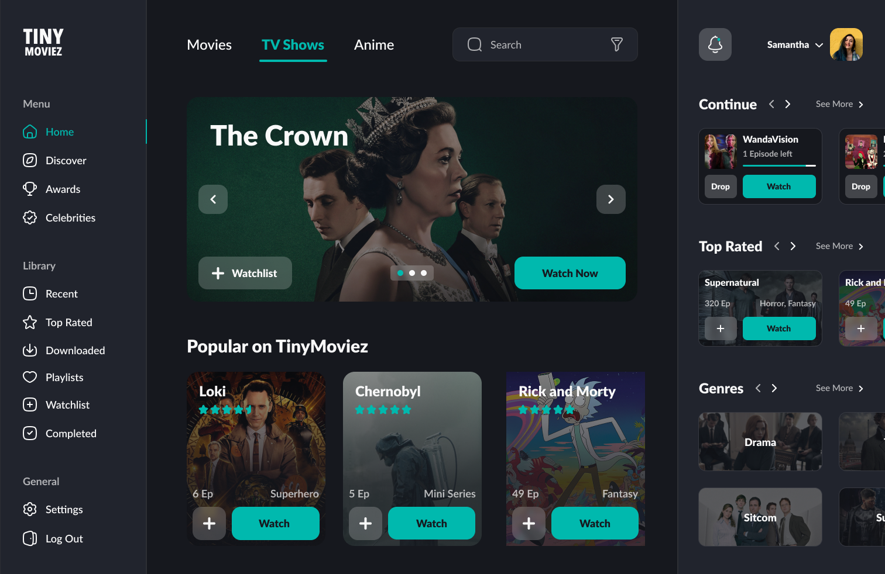

# Movie Streaming Dashboard
* [About the project](#about-the-project)
* [Built With](#built-with)
* [Authors](#authors)
* [License](#license)
* [Contact](#contact)

## About the project
This project is a training for only front-end part, the goal is to improve FIGMA Design to React skills.  

## Built With

&nbsp;&nbsp;
&nbsp;&nbsp;
&nbsp;&nbsp;
&nbsp;&nbsp;
&nbsp;&nbsp;

## Authors

 - [Vatani Design](https://redl.ink/vatani) The Figma [Template](https://www.figma.com/community/file/1099352945401989333).
 - Ibrahim Dembele (me) The coding part.

## License

&nbsp;&nbsp;

## Contact
&nbsp;&nbsp;
&nbsp;&nbsp;
&nbsp;&nbsp;